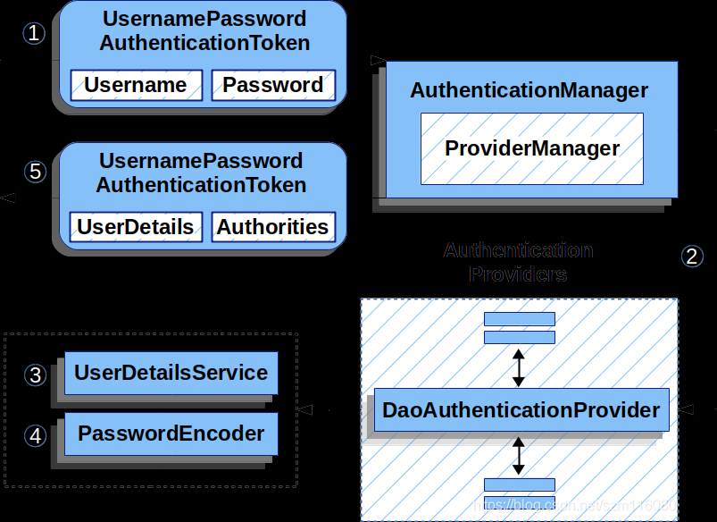

### 1. **How Your `PasswordEncoder` Is Used: The Chain**

1. **Bean Definition:**
    - You define a `PasswordEncoder` bean in your configuration class:
      ```java
      @Bean
      public PasswordEncoder passwordEncoder() {
          return new BCryptPasswordEncoder();
      }
      ```

2. **Wiring the Bean:**
    - Spring automatically injects this `PasswordEncoder` bean into components that need it. Specifically, it is injected into the `DaoAuthenticationProvider` via its `setPasswordEncoder` method.

3. **DaoAuthenticationProvider Configuration:**
    - When you configure Spring Security, the `DaoAuthenticationProvider` is either auto-configured or manually configured to use this `PasswordEncoder`:
      ```java
      @Bean
      public DaoAuthenticationProvider authenticationProvider() {
          DaoAuthenticationProvider provider = new DaoAuthenticationProvider();
          provider.setUserDetailsService(userDetailsService());
          provider.setPasswordEncoder(passwordEncoder());  // Your encoder is set here
          return provider;
      }
      ```

4. **Authentication Process:**
    - During the authentication process, `DaoAuthenticationProvider` uses the `PasswordEncoder`:
        - **Password Matching:** The `additionalAuthenticationChecks` method in `DaoAuthenticationProvider` uses `passwordEncoder.matches(presentedPassword, storedPassword)` to verify that the provided password matches the stored hashed password.

### 2. **How the Login Method Authenticates: The Class Chain**

1. **Login Method in `LogInServiceImpl`:**
    - You call the `login` method, passing in the `User` object containing the username and password:
      ```java
      public void login(User user) {
          UsernamePasswordAuthenticationToken authenticationToken = 
              new UsernamePasswordAuthenticationToken(user.getUserName(), user.getPassWord());
          Authentication authenticate = authenticationManager.authenticate(authenticationToken);
          // Further processing...
      }
      ```

2. **Creating the Authentication Token:**
    - `UsernamePasswordAuthenticationToken` is created to hold the user's credentials (username and password).

3. **AuthenticationManager:**
    - The `authenticationToken` is passed to the `AuthenticationManager`’s `authenticate` method. The `AuthenticationManager` coordinates the authentication process.
    - Typically, `AuthenticationManager` is implemented by `ProviderManager`, which delegates the authentication to a list of `AuthenticationProvider`s.

4. **DaoAuthenticationProvider:**
    - `ProviderManager` iterates through its configured `AuthenticationProvider`s (which includes `DaoAuthenticationProvider`).
    - If `DaoAuthenticationProvider` supports the authentication type, it handles the authentication process:
        - **Loading UserDetails:** It retrieves user details from the database via `UserDetailsService`.
        - **Password Check:** It uses the injected `PasswordEncoder` to check if the provided password matches the stored password.

5. **Result:**
    - If the credentials are valid, `DaoAuthenticationProvider` returns a fully authenticated `Authentication` object.
    - If successful, the `authenticate` method in your `LogInServiceImpl` receives this `Authentication` object, indicating that the user is authenticated.



### **Summary:**

1. **PasswordEncoder Usage Chain:**
    - Bean definition → Injection into `DaoAuthenticationProvider` → Used for password matching during authentication.

2. **Login Authentication Chain:**
    - Login method → Create `UsernamePasswordAuthenticationToken` → `AuthenticationManager` (`ProviderManager`) → `DaoAuthenticationProvider` → Password check with `PasswordEncoder` → Successful authentication returns an `Authentication` object.


Role of PasswordEncoder: Ensures passwords are securely hashed before storage and during comparison at login.
Login Process: The plain text password provided by the user is encoded and compared to the stored hashed password using the PasswordEncoder.