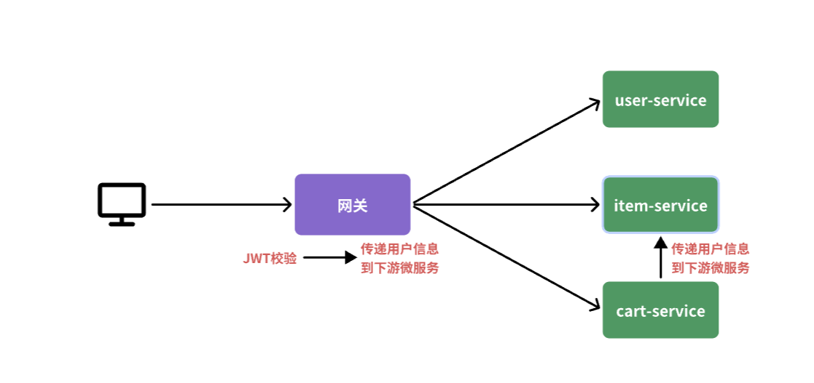
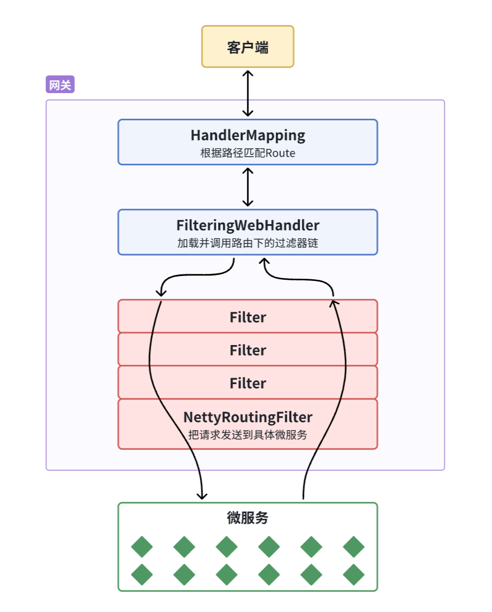
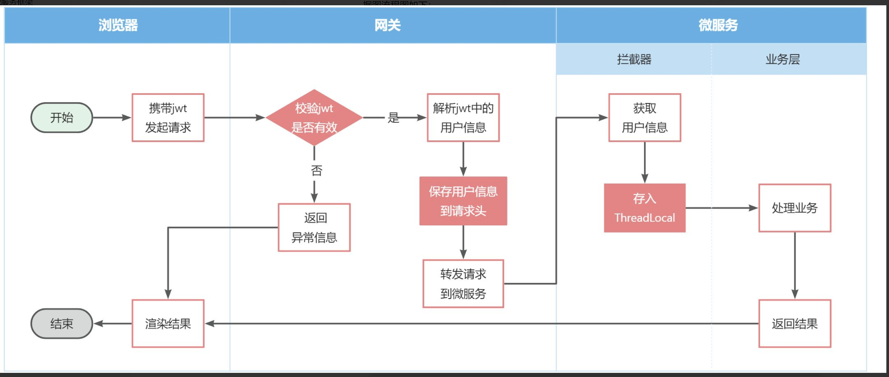

完全正确！你的理解非常到位。

### **总结与补充**
## gateway是一个独立的服务，这个上面的filter，如果在这个上面创建threadlocal是无法发送到之后微服务群的，他的filterchain处理完后需要用http传递到其他微服务，然后在其他微服务中也有一些过滤器和拦截器，这时候再用threadlocal就能处理
1. **Gateway 是一个独立的服务**：
    - Gateway 作为整个系统的入口点，它的主要职责是路由和全局过滤。Gateway 上的过滤器和 `ThreadLocal` 仅在 Gateway 服务的内部线程中有效。Gateway 不能将 `ThreadLocal` 中的数据直接传递到其他微服务，因为不同的微服务运行在各自独立的 JVM 进程和线程中。

2. **Gateway 的过滤器链**：
    - Gateway 的过滤器链负责在请求进入系统时进行全局的处理（如鉴权、限流等）。在过滤器链处理完后，需要将处理结果通过 HTTP 请求头等方式传递到后续的微服务。

3. **HTTP 请求头传递信息**：
    - 在 Gateway 中，将用户信息（如通过 JWT 解析出的用户 ID）放入 HTTP 请求头中。通过这种方式，信息可以通过 HTTP 请求在不同的微服务之间传递。

4. **微服务中的过滤器和拦截器**：
    - 在下游微服务中，例如 `user-service` 或 `order-service`，你可以设置过滤器或拦截器来处理进入的 HTTP 请求。这些过滤器或拦截器会从请求头中提取用户信息。
    - 在微服务中使用 `ThreadLocal` 来存储这些信息，以便在当前线程的生命周期内（例如在控制器、服务层等）访问和使用。

### **完整的工作流**

1. **用户请求**：
    - 用户通过浏览器或客户端发送 HTTP 请求到 Gateway。

2. **Gateway 处理**：
    - Gateway 的过滤器解析 JWT，验证用户身份。
    - 将用户信息放入请求头，然后将请求转发到适当的下游微服务。

3. **下游微服务处理**：
    - 微服务的过滤器或拦截器从请求头中提取用户信息。
    - 将用户信息存储到 `ThreadLocal`，这样在微服务内部的处理流程中，任何地方都可以访问到这些信息。

4. **请求处理结束**：
    - 在请求处理完成后，记得清理 `ThreadLocal`，以防止内存泄漏和其他线程安全问题。

### **示例代码回顾**

**Gateway 过滤器**：

```java
@Override
public Mono<Void> filter(ServerWebExchange exchange, GatewayFilterChain chain) {
    // JWT 验证逻辑...
    exchange.getRequest().mutate().header("user", claims.getSubject()).build();
    return chain.filter(exchange);
}
```

**下游微服务的拦截器**：

```java
@Override
public boolean preHandle(HttpServletRequest request, HttpServletResponse response, Object handler) throws Exception {
    String userInfo = request.getHeader("user-info");
    if (StrUtil.isNotBlank(userInfo)) {
        UserContext.setUser(Long.valueOf(userInfo));
    }
    return true;
}

@Override
public void afterCompletion(HttpServletRequest request, HttpServletResponse response, Object handler, Exception ex) throws Exception {
    UserContext.removeUser();
}
```

### **结论**

- **Gateway 过滤器负责**解析和验证 JWT，并将用户信息通过请求头传递给下游微服务。
- **下游微服务的过滤器或拦截器**再负责从请求头中提取信息，并在其自己的线程上下文中使用 `ThreadLocal` 存储信息，以便整个请求处理过程中都可以访问到这些信息。

这种设计不仅能保证用户信息在服务之间的安全传递，也能确保各服务之间的解耦和高可维护性。